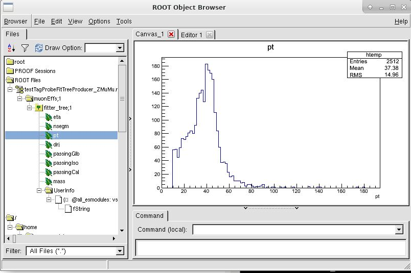

# TagAndProbe

## Work in progress!

Configuration files for the Tag-and-probe method to be used with the CMS Open Data

This repository contains two configuration files, one to produce a root tree with the desired variables and the selection criteria, the other to do the fitting and to derive the efficiency value(s) for the selection criteria in question.

The producer configuration `testTagProbeFitTreeProducer_ZMuMu_OpenData.py` is originally from https://github.com/cms-sw/cmssw/blob/CMSSW_5_3_X/PhysicsTools/TagAndProbe/test/testTagProbeFitTreeProducer_ZMuMu.py with 
 - flag `isMC` set as "false" 
 - process `muMcMatch` commented out from the path.

The analyzer configuration is built to match the output of the producer. 

Detailed documentation of the two parts in
- https://twiki.cern.ch/twiki/bin/view/CMSPublic/SWGuideTagProbeFitTreeProducer
- https://twiki.cern.ch/twiki/bin/view/CMSPublic/SWGuideTagProbeFitTreeAnalyzer

## Fitter tree production

Run in the CMS Open Data environment (if in the VM, inside the `CMS Shell`) with:

```
cd CMSSW_5_3_32/src
cmsenv       
mkdir WorkDir
cd WorkDir/
git clone git://github.com/katilp/TagAndProbe
cd TagAndProbe
cmsRun testTagProbeFitTreeProducer_ZMuMu_OpenData.py
```

The output file of the producer (when run over only one AOD root file) looks as follows:



## Computing efficiency

Compute the efficiency with 

```
cmsRun testTagProbeFitTreeAnalyzer_ZMuMu_OpenData.py
```
